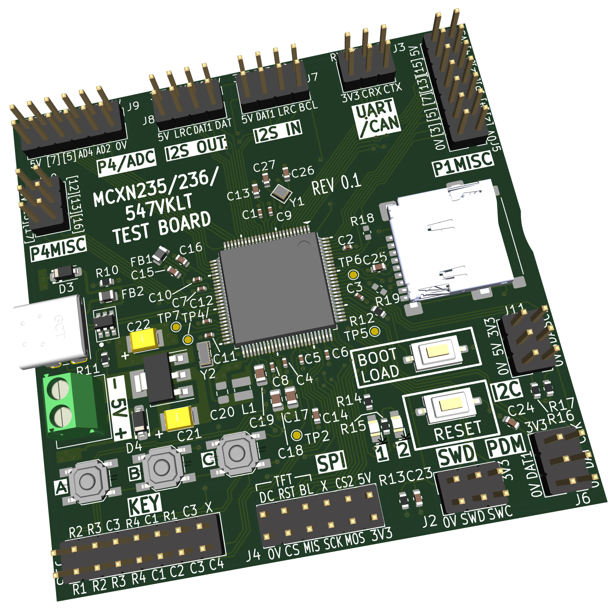

# EZ-MCXN

This repository contains NXP MCXN related content.

# MCXN236 Test Board

This test board is intended for trying out the MCXN236VKLT microcontroller (100-pin HLQFP 0.5 mm package). The 235 variant is also possible, and there's a good chance the MCXN547VKLT microcontroller will work too.



# MCX Projects

This folder contains a board config and example blinky application source code. The folders may be hard-coded in places; the mcx\_projects folder can be placed at `c:\dev\projects` to keep things seamless, otherwise you may need to edit files.

# Environment Variables

The following user vars (environment variables) may need to be created:

`ARMGCC_DIR = C:\DEV\arm_gnu_toolchains\15.2.rel1 `(this folder should contain bin, include, lib folders and so on)

`MCUXPRESSO_SDK_ROOT = C:\dev\projects\mcuxpresso-sdk\mcuxsdk`

# Double Blinky

## Overview

Double Blinky is a simple MCUXpresso SDK project that blinks two LEDs.

The example uses:

* LED1: P3_6
* LED2: P3_1

Both LEDs are active high.

The project also provides a simple starting point for creating new projects using the EZ-MCXN board configuration.

## Prerequisites

The following are required:

* MCUXpresso SDK installed under `C:\dev\projects\mcuxpresso-sdk`
* Arm GNU Toolchain
* CMake and Ninja
* Python
* MCUXpresso Config Tools
* `west`

The project workspace is expected to be:

```text
C:\dev\projects\mcx_projects
```

For example:

```text
C:\dev\projects\mcx_projects\
├── _boards\
│   └── ez_mcxn\
└── double_blinky\
```

The `MCUXPRESSO_SDK_ROOT` environment variable must point to the MCUXpresso SDK:

```text
C:\dev\projects\mcuxpresso-sdk\mcuxsdk
```

## Building the Project

Open PowerShell in the project directory:

```powershell
cd C:\dev\projects\mcx_projects\double_blinky
```

For a clean build:

```powershell
.\build.ps1 pristine
```

The build output is placed in:

```text
double_blinky\output
```

The main generated files are:

```text
output\double_blinky.elf
output\double_blinky.bin
```

Useful build commands are:

```powershell
.\build.ps1
.\build.ps1 clean
.\build.ps1 pristine
.\build.ps1 menuconfig
.\build.ps1 list
```

The commands have the following purposes:

* `.\build.ps1` — Builds the project using the existing build configuration. This is normally the quickest command to use after changing source code.
* `.\build.ps1 clean` — Cleans compiled files from the existing build, then allows the project to be rebuilt.
* `.\build.ps1 pristine` — Deletes the existing build configuration and creates it again from scratch. Use this after changing board files, Kconfig settings or CMake files, or if a normal build behaves unexpectedly.
* `.\build.ps1 menuconfig` — Opens the interactive Kconfig configuration interface, allowing SDK and project configuration options to be viewed or changed.
* `.\build.ps1 list` — Displays the project/build configuration being used by the script, such as the board, SDK, toolchain and build directory.

For normal source-code changes, `.\build.ps1` is usually sufficient. Use `pristine` after changing the board configuration, Kconfig files or CMake files.

## Creating a New Project

`double_blinky` can be used as a template for another application.

Copy the project folder and give it a new name. For example:

```text
C:\dev\projects\mcx_projects\testproj
```

Then:

1. In `CMakeLists.txt`, change the project name from `double_blinky` to `testproj`.
2. In `Kconfig`, change the displayed project name.
3. Modify `main.c` for the new application.
4. Build with:

```powershell
.\build.ps1 pristine
```

The existing `ez_mcxn` board configuration can be shared by multiple projects.

## Board Configuration

Board configurations are stored in:

```text
C:\dev\projects\mcx_projects\_boards
```

The board used by this project is:

```text
C:\dev\projects\mcx_projects\_boards\ez_mcxn
```

The important files include:

```text
ez_mcxn\
├── board\
├── board.c
├── board.h
├── CMakeLists.txt
├── EZ_MXCN.mex
├── Kconfig
├── Kconfig.defconfig
├── prj.conf
└── variable.cmake
```

The `board` subfolder contains files generated by MCUXpresso Config Tools, such as:

```text
clock_config.c
clock_config.h
peripherals.c
peripherals.h
pin_mux.c
pin_mux.h
```

Do not normally edit these generated files manually.

## Adding or Modifying Peripherals

Launch MCUXpresso Config Tools and open:

```text
C:\dev\projects\mcx_projects\_boards\ez_mcxn\EZ_MXCN.mex
```

Use Config Tools to modify pins, clocks and peripherals.

When finished, use **Update Code** to regenerate the files in the `board` subfolder.

Then rebuild the application:

```powershell
.\build.ps1 pristine
```

## Creating a New Board Configuration

If a project needs different hardware without changing the shared `ez_mcxn` configuration, make a copy of the board folder.

For example:

```text
C:\dev\projects\mcx_projects\_boards\myboard
```

Update the board name where required, particularly in:

```text
Kconfig
variable.cmake
board.h
```

Rename the `.mex` file if desired, open it with MCUXpresso Config Tools, make the required pin, clock and peripheral changes, and run **Update Code**.

Finally, change the `$Board` setting in the project's `build.ps1`:

```powershell
$Board = "myboard"
```

Then perform a pristine build.

## EZ-MCXN Hardware

The current EZ-MCXN configuration uses:

* MCU: MCXN236
* Main crystal: 24 MHz
* RTC crystal: 32.768 kHz
* System clock: 150 MHz
* LED1: P3_6, active high
* LED2: P3_1, active high
* UART RX: P1_8
* UART TX: P1_9
* UART: LP_FLEXCOMM4 / LPUART
* UART baud rate: 115200

## Debugging and Programming

### Using a Debug Probe

A compatible SWD debug probe, for example MCU-Link, can be used for programming and debugging.

Build the project first using:

```powershell
.\build.ps1 pristine
```

The ELF file for debugging/programming is then available at:

```text
output\double_blinky.elf
```

### Programming Without a Debug Probe

The MCXN236 contains a ROM-based ISP (In-System Programming) bootloader. This makes it possible to program the internal flash without an SWD debug probe.

The ROM bootloader supports several communication interfaces, including USB HID.

The EZ-MCXN board has a USB connector connected to the MCU USB signals and push-buttons labelled `BOOT LOAD` and `RESET`.

To enter ROM ISP mode:

1. Connect the EZ-MCXN USB connector to the PC.
2. Press and hold `BOOT LOAD`.
3. While continuing to hold `BOOT LOAD`, press and release `RESET`.
4. Release `BOOT LOAD`.

The MCXN236 should now be running its built-in ROM ISP bootloader rather than the application in flash.

The PC can communicate with the ROM bootloader using NXP's `blhost` command-line utility or MCUXpresso Secure Provisioning Tool.

A useful first test with `blhost` is to ask the bootloader for its version/property information. For USB HID, `blhost` uses the USB VID/PID of the ROM bootloader.

For example, the MCXN236 ROM ISP used on NXP's FRDM-MCXN236 is accessible with:

```powershell
blhost -u 0x1FC9,0x0158 -- get-property 1
```

If this succeeds, the PC is communicating with the MCXN236 ROM bootloader.

The application binary produced by this project is:

```text
output\double_blinky.bin
```

For an unsecured development device using the normal internal-flash boot configuration, firmware can be written to the beginning of internal flash using the ROM ISP tools.

NXP's MCUXpresso Secure Provisioning Tool is recommended when initially setting up or verifying this process because it provides a GUI for selecting the MCXN236, establishing the ISP connection, preparing the image and programming the device.

After programming is complete, press `RESET` without holding `BOOT LOAD`. The MCU should then boot the application normally from internal flash.

> **Note:** ROM ISP is different from installing a custom USB DFU bootloader. The MCXN236 ROM bootloader is already built into the chip and cannot be accidentally erased with the application. Secure-boot, lifecycle and CMPA configuration can change what the ROM permits, so the simple procedure above assumes an unsecured development device with the normal internal-flash boot configuration.


